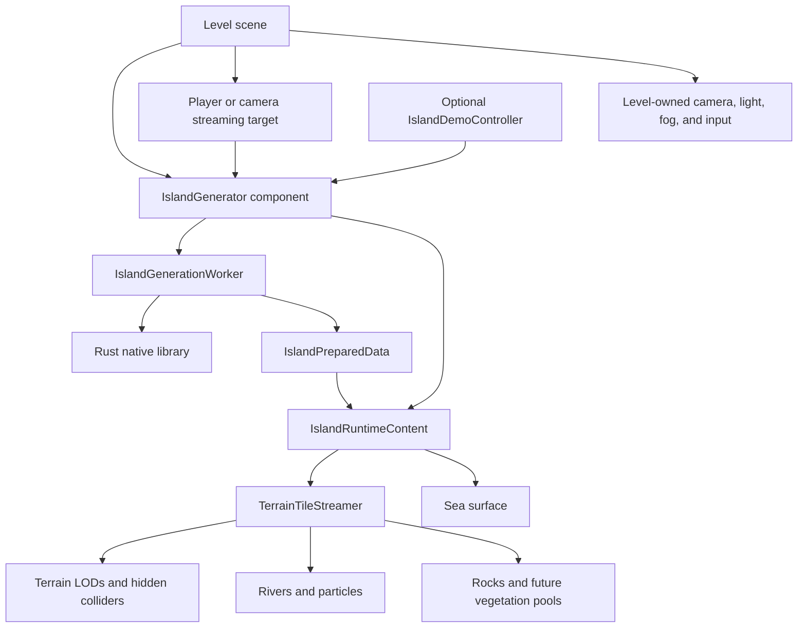

# Unity Level Architecture Migration Plan

## Implementation Status

Implemented on 2026-08-18. The Unity project now has an `IslandGenerator`
component, serialized settings and asset seams, independent generation/data
ownership, transform-aware streaming, per-island material instances, a saved
`IslandSandbox` level, editor controls, and component/scene/native batch
validation. Tree and plant placement remains intentionally outside this
migration; their prefab libraries are serialized for the upcoming vegetation
phase.

## Goal

Convert the Unity viewer into a conventional scene-based Unity project. A level designer should be able to add an `IslandGenerator` component to a GameObject, configure the island through clearly labelled Inspector fields, assign materials, textures, and future decoration prefabs, and generate the island without the project silently creating cameras, lights, controls, or global scene settings.

The migration must preserve the current procedural terrain, streamed LODs, terrain colliders, rivers, waves, grass, rocks, and native Rust generation while separating reusable island runtime code from the example level and its debug controls.

## Current Baseline

- The project has no saved `.unity` scenes and no scenes in Build Settings.
- `IslandViewer` creates itself through `RuntimeInitializeOnLoadMethod` after any scene loads.
- `IslandViewer` currently owns generation settings, native-handle lifetime, background preparation, generated textures and materials, the sea, camera, light, fog, controls, debug UI, and cleanup.
- `TerrainTileStreamer` owns streamed terrain, river, grass, rock, particle, and hidden terrain-collider children, but its prepared-data types are nested in `IslandViewer`.
- Streaming calculations assume the island is centred and axis-aligned at world origin.
- Materials and procedural textures are constructed entirely at runtime, so there are no Inspector asset seams for authored terrain textures or tree/plant models.

This plan starts from commit `3700379` (`Add streamed stone and boulder decoration`).

## Target User Experience

1. Open a saved level such as `Assets/Scenes/IslandSandbox.unity`.
2. Create a GameObject and add the `IslandGenerator` component.
3. Choose a seed and terrain settings in labelled Inspector sections.
4. Assign material templates, texture overrides, and decoration prefab libraries.
5. Assign a player or camera Transform as the streaming target.
6. Enable **Generate On Start** or press an explicit play-mode **Generate** button.
7. Move, rotate, duplicate, disable, regenerate, or remove the island using normal Unity scene workflows.

An empty scene must remain empty. Adding an island must not create or alter the level's camera, lighting, fog, input setup, or global render settings.

## Proposed Runtime Structure



### `IslandGenerator`

The public, reusable `MonoBehaviour` attached to the level GameObject. It should:

- expose all designer-facing settings as serialized fields;
- validate settings in `OnValidate` without generating terrain;
- provide `Generate()`, `Regenerate()`, and `Clear()` methods;
- expose read-only runtime state such as `IsGenerating`, `Status`, and generation statistics;
- own cancellation and deterministic teardown when disabled, destroyed, or regenerated;
- create generated children beneath one clearly named runtime root;
- pass an island-local streaming position to the streamer;
- never create a camera, light, controller, or debug UI;
- never change `RenderSettings` or other global scene state.

`IslandGenerator` states what the component does without repeating the meaning of *motu* or claiming the generic `Island` type name for the whole project.

### Settings types

Use `[Serializable]` settings groups declared as focused types and serialized directly on `IslandGenerator`. This preserves a single obvious component while keeping the implementation maintainable:

- `IslandGenerationSettings`
- `IslandRiverSettings`
- `IslandStreamingSettings`
- `IslandRenderingSettings`
- `IslandDecorationSettings`
- `IslandDebugSettings`

Use `[Header]`, `[Tooltip]`, `[Min]`, and `[Range]` consistently. Field labels and tooltips must state units such as metres, degrees, hectares, texture pixels, or normalized ratios. Settings that require regeneration should say so; visibility and material settings that can update live should apply immediately.

### Generation and native ownership

- `IslandGenerationWorker` converts serialized settings to `MotuNative.Options`, runs native work off the main thread, and copies results into managed data.
- `NativeIslandHandle` wraps the native pointer in an `IDisposable`/safe ownership boundary so every failure and cancellation path releases it exactly once.
- `IslandPreparedData` owns the managed meshes, surface maps, sea mask, collider height map, river emitters, and rock placements currently nested inside `IslandViewer`.
- Unity objects must continue to be created or destroyed only on Unity's main thread.
- A generation result is installed atomically: the old island remains valid until the replacement data is ready, then its runtime content is swapped and disposed.

### Runtime content ownership

`IslandRuntimeContent` should own the generated hierarchy and all per-generation resources:

- cloned material instances;
- generated `Texture2D` and `Texture3D` objects;
- the sea surface;
- `TerrainTileStreamer` and its children;
- native handle and prepared data required for continued streaming.

Destroying or clearing the component must leave no hidden TerrainData, Mesh, Material, Texture, or native-handle allocations behind. Generated meshes and terrain data remain runtime-only and must not be serialized into the scene.

### Scene and demo separation

Add `Assets/Scenes/IslandSandbox.unity` and include it in Build Settings. It should contain:

- an `Island` GameObject with `IslandGenerator`;
- a level-owned directional light;
- a level-owned main camera;
- optional orbit/first-person controls for the sample;
- an optional `IslandDemoController` containing the current IMGUI generation/debug controls.

`IslandDemoController` may populate and call `IslandGenerator`, but `IslandGenerator` must not depend on it. Remove the runtime bootstrap after the saved scene reaches feature parity.

## Inspector Contract

The first migration should expose the following contract. Existing values become defaults so the migrated sample scene initially looks and behaves like the current viewer.

| Inspector section | Label | Type / units | Initial default | Behaviour |
|---|---|---:|---:|---|
| Lifecycle | Generate On Start | bool | On | Generate when entering Play Mode |
| Lifecycle | Streaming Target | Transform | sample camera/player | Drives LOD, colliders, rocks, and river effects |
| Generation | Seed | int | 666 | Requires regeneration |
| Generation | World Size | metres | 2000 | Converts native normalized coordinates to island-local metres |
| Generation | Maximum Height | metres | 400 | Displayed in useful scene units and converted to the current normalized `maxZ` value |
| Generation | Water Ratio | normalized | 0.95 | Range 0.60-0.95 |
| Landform | Inland Slope Multiplier | multiplier | 1.3 | Range 0.2-4.0 |
| Landform | Coastal Slope Multiplier | multiplier | 1.0 | Range 0.1-4.0 |
| Erosion | Hydraulic Erosion | strength | 1.0 | Range 0-8 |
| Erosion | Sediment Deposition | strength | 1.5 | Range 0-4 |
| Erosion | Deposition Maximum Slope | degrees | 12 | Range 1-45 |
| Rivers | Source Catchment | hectares | 0.05 | Logarithmic editor control, range 0.01-10 |
| Rivers | Steep Source Multiplier | multiplier | 4.0 | Range 1-8 |
| Rivers | Source Elevation Boost | multiplier | 9.0 | Range 0-20 |
| Rivers | Show Rivers | bool | On | Applies live |
| Rivers | Show Rough-Water Debug | bool | Off | Debug only, applies live |
| Rendering | Terrain Material | Material template | Motu default asset | Cloned per island |
| Rendering | Grass Material | Material template | Motu default asset | Cloned per island |
| Rendering | River Material | Material template | Motu default asset | Cloned per island |
| Rendering | Sea Material | Material template | Motu default asset | Cloned per island |
| Rendering | Rock Material | Material template | Motu default asset | Cloned per island |
| Rendering | Grass Brightness | multiplier | 1.35 | Applies live |
| Rendering | Show Sea / Grass / Rocks | bools | On | Apply live without regeneration |
| Texture Overrides | Terrain Surface Textures | Texture2D references | unset | Authored inputs consumed by a later rendering phase |
| Texture Overrides | Cliff Detail Noise | Texture3D | generated fallback | Optional authored replacement |
| Texture Overrides | River / Grass Patch Noise | Texture2D | generated fallback | Optional authored replacements |
| Decoration Assets | Stone and Boulder Prefabs | GameObject array | empty | Later replaces or augments procedural prototypes |
| Decoration Assets | Tree Prefabs | GameObject array | empty | Stable future placement seam |
| Decoration Assets | Plant Prefabs | GameObject array | empty | Stable future placement seam |
| Debug | Show Mesh Edges | bool | Off | Applies live |

Use prefab/model GameObject references for decoration libraries rather than bare meshes. This preserves authored materials, child meshes, `LODGroup`, pivots, and future metadata. The first refactor may show currently unused tree and plant lists as disabled or explicitly labelled **Reserved for vegetation placement**; it must not imply those models are already generated or pooled.

The removed native fields `removedCoastalErosionStrength` and `removedBeachFormationStrength` should not appear in the Inspector unless native generation begins using them again.

## Transform and Level-Placement Rules

The component must define native terrain coordinates as island-local space, with the generated island centred on the component's local origin.

- Convert the streaming target with `transform.InverseTransformPoint(target.position)` before computing cells or querying native-local terrain positions.
- Transform raycast origins, results, particles, and other positions at the correct ownership boundary rather than passing mixed local/world coordinates.
- Feed island-local player coordinates to shaders that operate on island-local vertices, or explicitly convert shader calculations to world space as a complete unit.
- Parent sea, terrain, colliders, rivers, rocks, and particles beneath the island runtime root using local transforms.
- Support arbitrary translation and Y-axis rotation in the initial migration.
- Require uniform scale of `1` initially. `OnValidate` and runtime startup should issue a clear error for non-uniform or non-unit scale because physical heights, collider samples, particle sizes, and shader distances otherwise diverge.
- Add broader scale support later only after all metre-based shader and physics parameters are transformed consistently.

## Material and Asset Rules

- Store reusable default materials as project assets so they are visible and replaceable in the Inspector.
- Clone assigned material templates per island before writing generated maps or runtime properties; never mutate a shared project material.
- Treat generated native maps as per-generation resources owned by `IslandRuntimeContent`.
- When an optional texture override is absent, preserve the existing deterministic procedural texture fallback.
- Never use `AssetDatabase` from runtime code.
- Pools should eventually accept prefab libraries plus placement records through a narrow interface, allowing procedural rock meshes to remain the fallback.

## Migration Phases

### Phase 0 - Capture the baseline

- Record the current default seed, options, hierarchy, material values, visible feature counts, and generation validation command.
- Capture representative screenshots and runtime statistics for seed 666.
- Add a lightweight scene/runtime smoke-test checklist before decomposing `IslandViewer`.

Acceptance criteria:

- The reference scene can be regenerated from commit `3700379`.
- Terrain, rivers, sea, grass, rocks, particles, and terrain colliders each have an explicit parity check.

### Phase 1 - Extract serializable contracts and prepared data

- Introduce the settings groups and `IslandPreparedData` without changing generated output.
- Move `PreparedMesh`, `PreparedColliderHeightMap`, river-emitter, rock-decoration, surface-map, and sea-mask types out of `IslandViewer`.
- Replace `TerrainTileStreamer` references to nested viewer types with the independent data types.
- Centralize option validation and conversion, especially metres-to-normalized maximum height.

Acceptance criteria:

- The existing viewer still runs with identical defaults.
- Prepared-data types have no dependency on camera, UI, or demo code.
- Invalid ranges are clamped or reported with field-specific messages.

### Phase 2 - Extract generation and deterministic lifetime management

- Add `NativeIslandHandle`, `IslandGenerationWorker`, and `IslandRuntimeContent`.
- Move async preparation and copied-data construction out of `IslandViewer`.
- Make cancellation, failure, regeneration, disable, and destroy converge on one idempotent cleanup path.
- Swap successful results atomically instead of destroying the current island before generation completes.

Acceptance criteria:

- Repeatedly regenerating, disabling, and destroying an island produces no native-handle leaks or stale generated children.
- A cancelled or failed generation leaves either the prior valid island or an empty clean component.
- Unity API use remains on the main thread.

### Phase 3 - Introduce `IslandGenerator` and asset-driven rendering

- Add the public component and Inspector groups.
- Move terrain, grass, river, sea, and rock material setup behind assignable templates.
- Create default material assets that reproduce the current runtime-created values.
- Retain procedural texture fallbacks while adding serialized texture override slots.
- Expose live visibility and brightness controls through component methods/properties.

Acceptance criteria:

- A designer can inspect and edit every current generation input without using IMGUI.
- Missing required materials produce actionable validation errors or a documented fallback, never null-reference failures.
- Two island components never mutate each other's shared material assets.

### Phase 4 - Make streaming transform-aware and target-agnostic

- Replace world-origin cell calculations with island-local calculations.
- Remove `TerrainTileStreamer` ownership from `FirstPersonController`; accept any assigned Transform.
- Audit terrain colliders, height sampling, rock/particle pools, grass interaction, river shaders, sea masks, and wireframe rendering for coordinate-space assumptions.
- Enforce the initial transform rules in editor and runtime validation.

Acceptance criteria:

- The island streams correctly at world origin and after translation plus Y rotation.
- The hidden TerrainCollider grid aligns with the visible terrain after those transforms.
- Rocks, river particles, grass interaction, and player-ground lookup remain aligned.
- A camera-only level can stream without adding the sample first-person controller.

### Phase 5 - Add the conventional level and remove auto-bootstrap

- Create `IslandSandbox.unity`, its metadata, and the Build Settings entry.
- Put camera, light, environment, and sample controls in the scene.
- Reduce `IslandViewer` to an optional `IslandDemoController`, or remove it once its useful UI/debug features have equivalents.
- Delete `RuntimeInitializeOnLoadMethod` bootstrap behaviour.

Acceptance criteria:

- Opening and playing the saved sample scene generates the same island experience.
- Playing a new empty scene creates no island, camera, light, or UI.
- Adding `IslandGenerator` to another scene is sufficient to generate terrain when its required properties are assigned.
- The island component does not change global fog or ambient settings.

### Phase 6 - Establish decoration extension seams

- Add serialized stone/boulder, tree, and plant prefab libraries with tooltips and validation.
- Refactor rock prototype creation behind a provider/factory interface while retaining the current low-poly procedural fallback.
- Define placement-record and pool interfaces that vegetation can reuse without coupling it to rock physics or `IslandViewer`.
- Document pivot, scale-in-metres, material, collider, and `LODGroup` expectations for authored prefabs.

Acceptance criteria:

- Assigning or removing a future asset library does not require changes to the core generator lifecycle.
- Existing procedural rocks remain visually and functionally unchanged until authored prefab support is deliberately enabled.
- Tree and plant fields are clearly marked as configuration seams, not implemented generation features.

### Phase 7 - Validation, documentation, and removal of compatibility code

- Move `BatchValidateNativeInterop` to a validation-specific class independent of the demo scene.
- Add edit-mode tests for settings conversion, transform conversion, cancellation state, and ownership cleanup where Unity permits.
- Add play-mode smoke tests for component generation, regeneration, translation/rotation, streaming target changes, and teardown.
- Update the README with the saved-scene workflow and steps for adding an island to a new level.
- Remove compatibility paths only after the sample scene and tests cover them.

Acceptance criteria:

- Unity C# compilation succeeds with no missing scripts or serialized references.
- Native interop batch validation succeeds.
- The scene and Build Settings files are tracked and reopen without manual repair.
- The parity checklist passes for terrain LODs, colliders, rivers, sea, grass, rocks, and particles.
- Documentation clearly distinguishes working features from reserved texture/tree/plant extension slots.

## Suggested File Layout

```text
Assets/
  Scenes/
    IslandSandbox.unity
  Scripts/
    Island/
      IslandGenerator.cs
      IslandGenerationSettings.cs
      IslandPreparedData.cs
      IslandGenerationWorker.cs
      NativeIslandHandle.cs
      IslandRuntimeContent.cs
      TerrainTileStreamer.cs
    Demo/
      IslandDemoController.cs
      OrbitCamera.cs
      FirstPersonController.cs
    Editor/
      IslandGeneratorEditor.cs
      IslandGeneratorValidation.cs
  Materials/
    MotuTerrain.mat
    MotuGrass.mat
    MotuRiver.mat
    MotuSea.mat
    MotuRock.mat
```

Existing scripts should be moved with their `.meta` files so Unity GUID references remain stable.

## Recommended Implementation Order

Implement Phases 1 and 2 as behaviour-preserving refactors before creating the new component. Then land Phases 3 through 5 together so the repository never depends on a half-migrated scene or an absent bootstrap. Phase 6 should establish the serialized asset contract but should not attempt vegetation placement in the same change. Finish with Phase 7 and delete the old viewer only after parity validation.

## Out of Scope for This Migration

- Implementing tree or plant generation and placement.
- Replacing the existing native terrain algorithm or changing its ABI without a demonstrated need.
- Baking generated terrain meshes into scene assets.
- Supporting arbitrary non-uniform island scaling.
- Introducing a new input framework, render pipeline, or global environment system.
- Converting the sample debug UI into production game UI.

These are deliberately separate so the conventional level/component boundary is stable before authored content and gameplay systems build on it.
