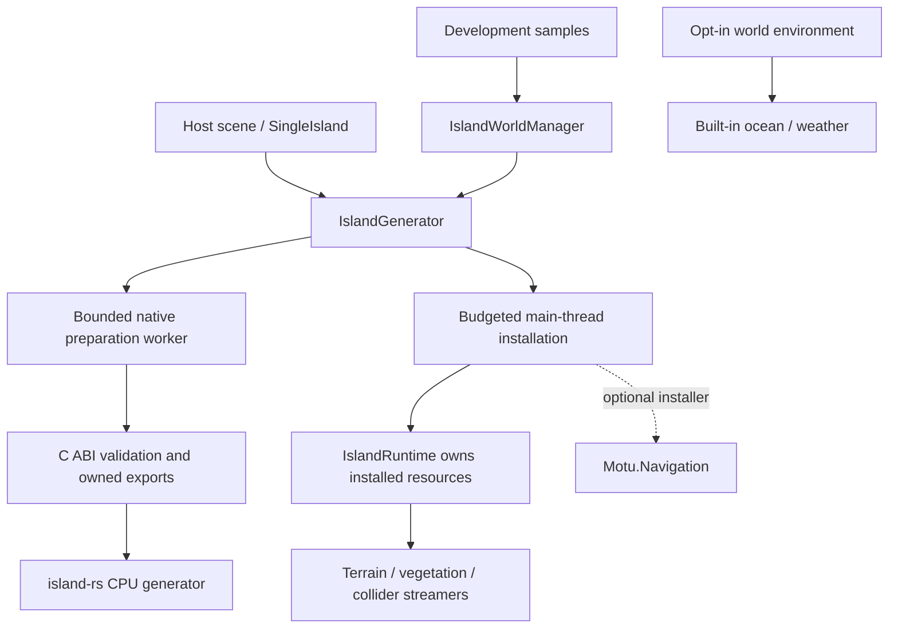

# Rationalization implementation report

Work started 15 September 2026 on `main`, from `2add9729525562e4aea1e09256dd676573e540c5`
plus the pre-existing scene, LOD seam, and navigation changes recorded in
[baseline.json](baseline.json). This report separates delivered changes from the
remaining whole-plan gates. The nine-phase plan is **not yet complete**.

## Delivered architecture

The reusable implementation now lives in two private UPM packages:

- `packages/com.motu.runtime`: generation, interop, streaming, settings, Built-in
  rendering, generic authoring tools, shader references, and the prebuilt native plugin.
- `packages/com.motu.navigation`: optional full-resolution navigation, depending
  on the runtime and Unity's AI engine module. It does not require the AI Navigation
  authoring package.
- `island-unity`: a consumer of those packages, retaining authored scenes,
  demonstration input/cameras/ship controls, scene construction tools, and the
  extensive development integration tests.



Existing script/shader/resource GUIDs were retained. Sample code has its own
assemblies; reusable buoyancy remains in the runtime. Generic authoring now uses
package resources and a chosen destination for waterline textures. Package asset
references and shader includes no longer rely on this project's `Assets` layout.
The OpenSeaWorld scene is byte-identical to the user-edited starting snapshot.

`SingleIsland` provides an Inspector entry point and a small optional script
sample. `IslandGenerator.GenerateAsync`, streaming target assignment, queries,
status/readiness, and `Clear` remain the lifecycle facade. An independent island
can use host-owned lighting without creating cameras, an ocean, or demo input.
It no longer enables depth textures on every camera or polls sample debug keys.
Generation settings can specify an absolute cache directory; creating a request
performs no directory creation.

## Ownership and correctness changes

- Native ABI version 1 is checked before either native entry point class is used.
  The handshake checks eight representative C record sizes and four mixed-padding
  forest offsets. Existing array, finite-value, mesh/index and release validation
  remains in place. This is not a claim that every native field is introspected.
- One queued native preparation runs at a time. Cancellation while waiting consumes
  no worker; cancellation during a native call releases its data after that call returns.
- Authored assets are borrowed. Generated assets belong to the island runtime.
  Shared procedural noise uses idempotent leases and is destroyed after the last
  resident owner releases it.
- Cache hits remain usable when timestamps cannot be updated. Failed optional
  writes fall back to generation. Eviction selects only completed, hash-named
  `.motusnapshot` and `.motumaterials` files, preserving temporary and host files.
- Core owns navigation through `IIslandNavigation`; the optional package owns
  Unity AI types and upload/bake lifetime. Whole unsliced LOD0, height mesh and
  the default 0.5 m agent radius are retained.
- A clean IL2CPP player exposed two navigation integration failures: stripping of
  the unreferenced installer assembly and unsupported `Process.WorkingSet64`
  telemetry. The assembly now retains its runtime initialization root with
  `AlwaysLinkAssembly`. IL2CPP skips process RSS sampling and reports it as
  unavailable, while Unity allocation sampling continues. Neither diagnostic
  availability nor scene references are prerequisites for a navigation bake.
- Explicit shader resources and LOD keyword materials keep runtime shader variants
  in players. A real Metal player build exposed two waterfall shadow macro failures;
  their position fields now match Unity's macro contract without changing wave,
  foam or waterfall equations.
- The Bevy inspector now labels and explains the existing initial-soil-depth parameter.
- The Bevy terrain atlas now explicitly uses its six terrain material slots. This
  fixes its pre-existing non-exhaustive TreeBark match and avoids requesting a bark
  bake that its terrain renderer does not consume.

## Packaging and validation tooling

`python3 scripts/pack-unity.py artifacts` creates deterministic private tarballs
and a SHA-256/size manifest. It does not publish or change remote Git state.
The native deployment script uses the package destination, accepts an override,
checks Apple Silicon, replaces the artifact atomically, and records build/hash/ABI
provenance. Its macOS library ID uses `@rpath/libmotu.dylib` instead of a build path.

`scripts/check-unity-packages.py` checks metadata, duplicate GUIDs, package-only
asset references, shader include paths, dependency direction, and native hashes.
`scripts/audit-codebase.py` inventories first-party source, build configuration,
assets/metadata, and operational documentation. It generates an API declaration
index and GUID map. **An inventory entry is not a completed code review.** Review
records are tied to content hashes and become stale when the input changes.

`scripts/validate-unity-package.sh` installs tarballs into a fresh project containing
no copied demo ProjectSettings, Assets or Library. It tests, builds and runs actual
native generation/render/unload. Options:

```sh
scripts/validate-unity-package.sh
MOTU_LIFECYCLE_CYCLES=20 scripts/validate-unity-package.sh
MOTU_WITH_NAVIGATION=1 scripts/validate-unity-package.sh
MOTU_IL2CPP=1 scripts/validate-unity-package.sh
island-unity/validate.sh --suite all
```

The development validator has named contracts, lifecycle, streaming, graphics,
navigation and serialization groups. Graphics checks require a working GPU.
GitHub workflows were added for native/package/tool checks and a manually triggered
licensed macOS Unity runner. These workflows have not been executed on GitHub;
no licensed self-hosted runner was provisioned by this change.

## Current evidence

See [validation.json](validation.json) for the exact run results and artifact IDs.
Native and Unity test reports are kept alongside this file. Tests marked skipped
are not represented as passes. Test durations collected alongside other builds
are correctness evidence, not performance benchmarks.

The development suite's stale shore-depth test was corrected to distinguish a
configurable authored profile from code defaults. Its pre-existing calm-foam test
also failed in the original isolated checkout: zero geometric displacement is
not zero analytic wave amplitude. The fixture now zeroes analytic amplitude for
its calm-water assertion and restores it for translucency checks. Rendering
behaviour was not retuned to satisfy either test.

The material CLI's old locked albedo hashes also failed in the starting code.
Commit `e5f0465` intentionally parameterized the cracked-stone and river-stone
colours; their tests still expected the earlier palettes. The two albedo hashes
now record those authored defaults. All eight non-albedo map hashes remain
unchanged, and all six material CLI tests pass. No recipe/evaluator change was
made to update these baselines.

Core and navigation both build and run in clean Mono and IL2CPP consumers. The
IL2CPP navigation check exercises a real full-resolution bake and registration,
not just compilation. An imported minimal sample also compiles and runs. Twenty
cold generation/unload cycles passed the owned-resource checks. These are
integration/lifecycle checks, not the complete rendering or world-travel matrix.

The stale native river integration fixture now has separate submerged and visible
river cases, plus a constructed multi-waterfall export check. This matches the
existing sea handoff behavior while retaining geometry, flow, bank and 3D UV
coverage. [KNOWN_FAILURES.md](KNOWN_FAILURES.md) maps the old assumptions to their
replacement fixtures and retains the baseline failure evidence. Production river
generation and appearance were not changed.

The missing macOS IL2CPP build module was discovered by attempting a real build,
then installed for Unity 6000.5.6f1 through the installed Hub CLI. The documented
[Hub module command](https://docs.unity.com/en-us/hub/hub-cli-reference#install-modules)
was used; the Unity Editor version was retained. Final backend results belong in
the validation record, not inferred from installation success.

## Performance evidence and limits

The first optimization shares identical immutable cliff, river and standalone
weather noise across resident islands. The benchmark compares four resident
standalone islands, warms both paths, then repeats three measurements. It measures
noise construction only, not full generation or whole-frame performance. It also
reduces those four islands from twelve such textures to three while they coexist.
World-managed weather was already shared and is not counted as a new saving there.
Median construction time fell from 382.08 ms to 95.54 ms in this focused benchmark
(75%); the first shared set still takes approximately 96 ms to construct.

No erosion, simplification, wave equation, river flow, material palette, or quality
preset was replaced as a performance shortcut. Existing main-thread frame budgets,
streaming profiler markers, navigation queue and native stage timers were retained.
The seed-17 CPU baseline now covers 128, 512 and 1,024 initial triangulation seed
points, with three repeated runs and stable geometry hashes per fixture. Medians
were 2.94 s, 13.91 s and 38.59 s; whole-process peak RSS was approximately 2.05,
3.54 and 3.76 GiB respectively. These are default native generation scenarios,
not the independently configured Unity consumer. Details are in
[generation-baseline.json](generation-baseline.json).

A complete CPU/GPU/residency performance matrix is still outstanding; local noise
savings do not establish a global FPS improvement.

## Remaining gates from the full plan

| Area | Remaining work and acceptance evidence |
| --- | --- |
| Complete code review | Close pending per-file ledger entries in dependency order. The current reviewed subset covers implemented boundary changes; it does not certify every native algorithm/tool/shader. |
| Performance matrix | Capture cold/warm small/typical/large generation, dense forests/caves, navigation, frame percentiles, GPU passes, peak residency and travel recovery on an otherwise idle machine. Establish budgets from that matrix. |
| Native/preparation profiling | Native stage costs are now ranked at 512/1,024 points. Sample operations inside erosion, final rivers and rock settling, then measure Unity preparation/upload separately before changing algorithms or copies. Preserve deterministic geometry and fixed-seed hashes. |
| Streaming and rendering | Exercise all neighbouring LOD combinations and the complete fixed-camera/weather matrix; profile uploads/collider cooking, variants, overdraw, reflections and underwater effects. Existing tests are useful but not a substitute for every planned scene. |
| Environment coexistence | Single-island ownership and additive environment unload are verified. One global owner is enforced; disable before changing the host active scene. Independent simultaneous oceans remain unsupported. |
| Long-run world residency | The package lifecycle probe covers repeated native handles and captured owned meshes/textures. It does not establish bounded global RSS/GPU memory or 20 full archipelago travel cycles. |
| Cave fixtures | Eight development tests need their separately generated cave snapshots/network fixtures; run those explicitly before closing their gate. |
| Distribution | Test a real previous-version upgrade and pinned Git release, configure licensed CI, and finish asset/native dependency redistribution review before a public release. Private 0.1.0 tarballs are not a public license grant. |
| Other hosts/platforms | Current target is Unity 6000.5.6f1, Built-in, Metal, Apple Silicon; no URP/HDRP/Windows/Linux/Intel/XR compatibility claim. Validate the next actual host project separately. |

The extracted packages now provide the integration boundary required for those
later measurements and changes; unresolved gates remain explicit in the plan.

### Environment ownership follow-up

Environment installation now acquires an exclusive owner. An uninitialized
component does not write host fog or weather globals. Host state is captured
once per activation; camera and borrowed-light state is captured when first used.
Disable restores fog, ambient light, sun, directional-light pose/colour/intensity,
camera background/depth, borrowed effect bindings, and all 30 cloud/wind globals.
Owned underwater effects are disabled then removed; deferred destruction is
handled during a same-frame re-enable. Generated sky/ocean resources are retained
while disabled and released on destruction, including owned helper components.
Re-enable captures fresh host values. A second initialized owner is rejected
before allocating environment resources.

The Play-mode lifecycle fixture covers disable/re-enable, same-frame re-enable,
second-owner rejection, borrowed effects, and unloading an additive environment
scene with the host scene still active. The final suite passed 134 tests with zero failures and eight external cave-fixture
skips. Fresh Mono and IL2CPP players passed generation, navigation, rendering,
disable/re-enable and additive unload. The IL2CPP player also passed with reads
from this repository denied. Exact artifact hashes and results are in the
`environment_followup` section of validation.json.

The host must disable Motu before switching the active scene. Unexpected switches
disable the owner and protect incoming RenderSettings; they do not restore the
now-inactive departed scene. This limitation is documented instead of temporarily
switching the host's active scene during cleanup and triggering unrelated scene
callbacks. Independent simultaneous oceans remain outside the package contract.

### Native regression and profiling follow-up

The complete CPU debug suite now passes: 468 tests, zero failures and three
existing ignored tests, including all 35 generation, six material CLI and four
seam tests. CPU library Clippy with warnings denied, Rust formatting and package
checks pass. The river reconciliation changes test fixtures only; the shipped
native binary and Unity packages are unchanged by this follow-up. The earlier
Unity/consumer results were not rerun for these test/tool/documentation changes.

A [stage-profile workflow](GENERATION_PROFILING.md) now excludes warmup, validates
complete logs and stable geometry, and ranks inclusive costs without double
counting nested labels. Four parser checks protect the measurement evidence.
Per-file reviews were extended to the benchmark, timer, LOD and terrain-sampling
boundaries; large test files retain explicit partial-review status.

Three-run native profiles at 512 and 1,024 points reproduce the earlier geometry
hashes. The default-size median was 35.52 s; hydraulic passes account for 16.23 s
of inclusive time, final rivers 6.94 s and rock settling 5.77 s. LOD simplification
and indexing were 1.15 s. [The profiling report](GENERATION_PROFILING.md) records
these priorities and the measurement limits. No native speedup is claimed: this
follow-up establishes attribution without changing generation algorithms.

### Measured native optimization

The next native change skips erosion geometry when the existing sea-plane limit
or fully depositional slope already makes erosion zero. Sediment transport,
deposition, soil cleanup and sequential path order remain intact; no new cache or
allocation was added. Three alternating before/after pairs reduced default
seed-17 generation from 32.91 s to 32.10 s median (2.47%), with hydraulic work
down 5.53%. All six complete comparison snapshots are identical.

The release CPU suite passes 469 tests (three existing ignored), including the
new 144-case exact step comparison. A pre-existing release-only forest assertion
was reproduced separately and corrected to compare runtime calculations while
retaining exact bits. The rebuilt packaged native plugin passes 134 development
Unity tests, with eight external cave-fixture skips, and fresh consumer checks.
Player backend results and exact artifacts are in validation.json.

[NATIVE_OPTIMIZATION.md](NATIVE_OPTIMIZATION.md) contains the measurements,
commands and limits. Restart an already-open Unity Editor to load the rebuilt
native library. Further native profiling, the full review ledger, GPU/frame and
world-residency work remain open.

### Rock settling follow-up

The CPU rock solver now reuses the terrain height/normal for bit-identical XY
positions. Contact response and ordered collision/sleep updates still run; each
body's sample exists only for that simulation. All six complete fixed-seed
snapshots match the preceding erosion build exactly. Three alternating timing
pairs reduced default seed-17 rock settling from 5.071 s to 3.427 s median
(32.42%) and complete native generation from 32.475 s to 30.998 s (4.55%).

The native release suite passes 470 tests with three existing ignored tests;
11 focused debug decoration tests and CPU Clippy also pass. The review ledger
now has 53 current manual reviews, with the remaining inputs still explicit.
[ROCK_OPTIMIZATION.md](ROCK_OPTIMIZATION.md) describes the invariants, measurement
method and limits. The `rock_optimization` validation entry records the rebuilt
plugin and packaged Unity checks; earlier milestone entries remain historical.

### Mesh boundary follow-up

Final-river sampling exposed repeated global perimeter-edge sorts. The shared
mesh boundary query now groups undirected edges by lower endpoint and sorts
small per-vertex groups. It preserves exact edge-use counts, including holes,
duplicate/degenerate faces and non-manifold topology. Scratch buffers stay local;
there is no persistent topology cache or serialized/public contract change.

Three alternating pairs reduced median final river construction from 6.809 s
to 4.106 s (39.70%) and complete seed-17 native generation from 30.819 s to
27.352 s (11.25%). All six complete snapshots remain byte-identical. The native
release suite passes 472 tests, with three existing ignored tests, and an
independent oracle covers 19,683 small topology combinations.

[MESH_BOUNDARY_OPTIMIZATION.md](MESH_BOUNDARY_OPTIMIZATION.md) records the
algorithm, ownership/memory tradeoff and measurement limits. The matching
`mesh_boundary_optimization` validation entry identifies the rebuilt plugin and
Unity package results. Mesh, river-footprint and final-river retry reviews are
explicitly partial; previous seam and scene changes remain intact.

### Travel streaming freezes

First focus now follows the incremental transition path. Terrain grid export and
managed copying run on a bounded worker; Unity uploads yield between operations
using the configured installation budget. Old/coarse neighborhoods remain visible
until replacement is complete. Native leases allow safe unload without waiting
for in-flight exports on the main thread. Critical collision remains immediate.

The retained single-island fixture recorded 284 ms blocking in the previous first
focus and about 9 ms with the revised path; this is not a controlled FPS benchmark.
135 development tests pass with eight existing fixture skips, and nine fresh
package tests pass. Mono and IL2CPP players both complete detailed streaming while
frames advance, plus navigation, rendering and environment teardown. The native
plugin is unchanged. There are now 57 current full manual reviews; the terrain
streamer/installer review is partial and the overall audit remains incomplete.

[STREAMING_FREEZES.md](STREAMING_FREEZES.md) distinguishes this confirmed blocking
path from the still-unprofiled prolonged live-world freezes and high allocation
telemetry. Exact artifacts and backend results are in `streaming_freezes` in
validation.json. Scene settings and prior unrelated changes are preserved.

### Navigation memory pressure

Navigation now indexes unchanged full-resolution faces on a worker and uploads
only one spatial chunk at a time. Defaults are 128-metre chunks and one bake
worker; source buffers are released between chunks. Height meshes remain enabled,
with short validated links joining the independently baked surfaces. Settings,
progress/peak-source counters, cancellation and registration cover all chunks.

The 1.74-million-triangle cached island completed 95 chunks, with a largest source
mesh payload of 1.50 MB versus the historical 32.11 MB monolithic source upload.
This bounds a navigation allocation, not all resident island/vegetation memory.
Full development validation passes 138 tests with eight existing fixture skips.
Backend results and exact artifacts are in the `navigation_chunks` validation
entry. The overall source audit remains incomplete (61 current full reviews).

[NAVIGATION_CHUNKS.md](NAVIGATION_CHUNKS.md) records the memory/timing limits and
a material remaining path-query limitation: 37 of 39 previously complete long
routes complete through standard APIs; two return partial despite complete routes
being found by a larger diagnostic query. The query/controller workaround is not
silently installed. Whole-computer lockups still require live-world profiling.

### Forest detail residency follow-up

Detailed wood and foliage are now exported by nearby owner region on a bounded
worker, instead of preparing and retaining whole-island LOD0 and LOD1 arrays.
The large cached island contains 2.354 GB of those array payloads. The largest
new temporary region was 20.01 MB; active Unity meshes and native forest geometry
remain resident. This is a measured duplicate-payload reduction, not a process
RSS or whole-computer freeze claim.

Transitions retire obsolete detail first, keep coarse owners visible until
replacement completes, and yield between uploads using the installation budget.
Cancellation, pending wireframes, native leases and collider retirement are
covered. The existing exporter and leaf exporter matched 96 nonempty meshes
exactly in bounded reference regions. No native binary or scene edit was made.
The final development suite passes 141 tests, with eight existing external
cave-fixture skips; the review ledger has 66 current full reviews.

[FOREST_STREAMING.md](FOREST_STREAMING.md) records source payload, upload timing,
ownership and memory limits. Fresh consumer/backend and artifact evidence is
recorded under `forest_streaming` in validation.json. Snapshot loading, whole-world
residency/recovery, frame/GPU profiles and the remaining audit gates are still
open, as are the previously reported long-distance navigation query differences.
